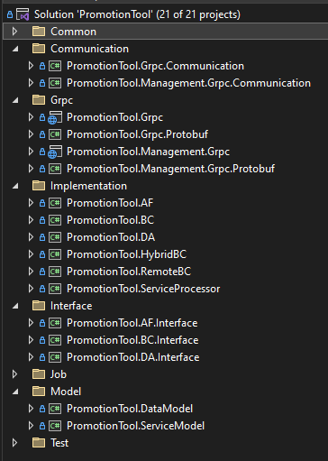

# Architecture and Design
- [Coding Architecture](#coding-architecture)
- [Folder Structure](#folder-structure)
- [Design Pattern](#design-patterns)

## Coding Architecture
The project follows a modular architecture pattern, separating functionality into distinct modules and layers for maintainability and scalability. The architecture consists of the following components:

| File | Description |
| ------ | ------ |
| AF (Application Facade) | Handle the entire flow of business logic |
| BC (Business Component) | Implement the business logic of the application |
| DA (Data Access) | Abstract the logic required to access the underlying data stores |
| Hybrid BC |  |
| Remote BC |  |
| Grpc |  |
| Management Grpc |  |
| Data Model |  |
| Service Model |  |

## Folder Structure
`something here...`  

## Design Patterns
The project utilizes the following design patterns to promote code reusability and maintainability:

**MVC (Model-View-Controller)**:  
Separating the user interface (View), business logic (Controller), and data retrieval/storage (Model) responsibilities.

**Repository Pattern**:  
The data access layer uses the repository pattern to abstract data operations and provide a consistent interface for accessing data entities.

**Dependency Injection**:  
Dependency injection is employed to manage the dependencies between different components, allowing for loose coupling and easier testing.
